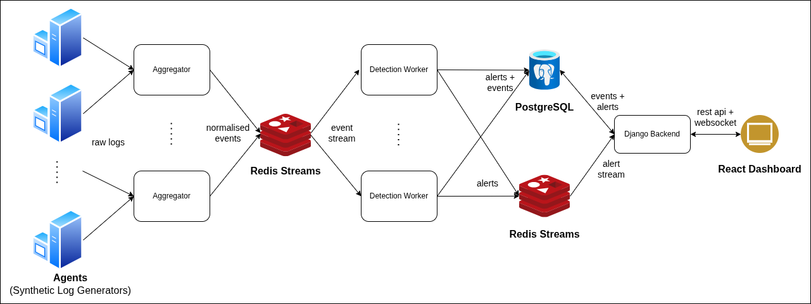

# System Architecture

## Overview

This system is designed to collect logs from multiple machines, process them, detect suspicious behavior, and present alerts to users through a dashboard.

The architecture follows a **stream-based processing pipeline**. Logs flow through multiple components where they are processed step by step.

The main goals of the architecture are:

* Handle logs from many machines
* Process events in near real-time
* Detect suspicious activities using rule-based detection
* Provide alerts to users through a dashboard
* Keep the system modular and scalable

Each component in the architecture has a specific responsibility.

---

# 1. Agents (Synthetic Log Generators)

In a real SIEM system, agents run on machines and collect logs from operating systems, applications, and network devices.

However, for this project we simulate this behavior using **synthetic log generators**.

Agents are Python programs that **generate artificial logs** to simulate system activity. This allows us to test the SIEM pipeline without requiring real infrastructure.

Each agent simulates logs such as:

* login attempts
* authentication failures
* network connections
* system events
* error messages

Agents can also simulate **abnormal activity patterns**, such as:

* high login failure rate
* repeated access attempts
* unusual traffic spikes

These synthetic logs are sent to the **aggregators**, where they are processed just like real logs in a production SIEM system.

This approach allows us to demonstrate how the system would behave in a real environment while keeping the setup simple and reproducible.

---

# 2. Aggregators

Aggregators receive logs from many agents.

Their responsibilities include:

* collecting logs from multiple sources
* parsing log formats
* extracting important fields
* converting logs into a standard structure

This step is called **normalization**.

Different systems generate logs in different formats. Aggregators convert these logs into a **common structured event format** so that downstream components can process them consistently.

The exact structure of the normalized event schema is documented separately.

See: [SCHEMA.md](SCHEMA.md)

After normalization, aggregators publish the structured events to **Redis Streams**.

Multiple aggregators can run in parallel to support higher log volumes and provide horizontal scalability.

---

# 3. Redis Streams (Event Queue)

Redis Streams acts as the **event streaming layer** of the system.

Its responsibilities:

* store incoming normalized events
* provide a queue for processing
* allow multiple workers to consume events

Why Redis Streams is used:

* supports streaming data
* enables scalable event processing
* allows multiple detection workers
* ensures events are not lost if workers restart

Events written to Redis Streams form an **event stream** that detection workers consume.

---

# 4. Detection Workers

Detection workers read events from Redis Streams.

Their job is to detect suspicious activity using **rule-based detection logic**.

Examples of detection rules:

* multiple failed login attempts
* access from suspicious IP addresses
* unusual system activity
* repeated authentication failures

When a rule is triggered:

1. an **alert** is generated
2. the alert is stored in the database
3. the alert is published for real-time notification

Multiple detection workers can run simultaneously. This allows the system to process large numbers of events.

---

# 5. PostgreSQL Database

PostgreSQL stores the main persistent data of the system.

The database stores:

* normalized events
* alerts generated by detection workers
* incidents created from alerts

This allows:

* historical analysis
* incident investigation
* dashboard queries
* audit trails

Using a relational database makes it easier to perform structured queries and analysis.

---

# 6. Redis Streams (Real-Time Alerts)

Redis Streams is also used for **alert delivery** in addition to event ingestion.

When detection workers generate alerts, they write them to a **separate Redis Stream dedicated to alerts**.

The Django backend consumes alerts from this stream using a **consumer group**.

Using Redis Streams for alerts provides several advantages:

* reliable delivery of alerts
* ability to replay alerts if needed
* persistence of alerts until they are acknowledged
* support for multiple consumers

This improves the reliability of the alerting system.

---

# 7. Django Backend

The Django backend acts as the **main API server** for the system.

It provides:

REST APIs for:

* fetching events
* viewing alerts
* managing incidents

It also manages:

* user authentication
* alert management
* communication with the database

The backend receives real-time alerts through Redis Pub/Sub and forwards them to the dashboard using **WebSockets**.

---

# 8. React Dashboard

The React dashboard is the user interface of the system.

Users interact with the system through this dashboard.

The dashboard allows users to:

* view detected alerts
* monitor system activity
* investigate incidents
* analyze log data

The dashboard communicates with the backend using:

* REST APIs for data retrieval
* WebSockets for real-time alerts

This ensures that new alerts appear immediately on the interface.

---

# 9. Event Flow Summary

The complete data flow is as follows:

1. Agents generate logs.
2. Logs are sent to aggregators.
3. Aggregators normalize logs into structured events.
4. Events are written to Redis Streams.
5. Detection workers read events from the stream.
6. Detection rules generate alerts.
7. Alerts and events are stored in PostgreSQL.
8. Alerts are written to Redis Streams.
9. Django consumes alerts from the stream and forwards them to the dashboard using WebSockets.
10. Users see alerts in real time.

---

# 10. Scalability

The architecture supports scaling by adding more components.

Examples:

More agents
→ simulate more machines

More aggregators
→ handle larger log volume

More detection workers
→ process events faster

Redis Streams and Pub/Sub allow the system to handle **high event throughput**.

---

# 11. Design Advantages

This architecture has several benefits:

**Modular design:** Each component has a clear responsibility.

**Scalability:** Workers and aggregators can scale horizontally.

**Reliability:** Redis Streams ensures that events and alerts are not lost, even if processing services restart.

**Replay capability:** Streams allow components to re-read events or alerts if necessary, which is useful for debugging and recovery.

**Real-time alert delivery:** Alerts are streamed to the backend and pushed to the dashboard using WebSockets.

**Separation of concerns:** Log collection, detection, storage, and visualization are independent.

---
